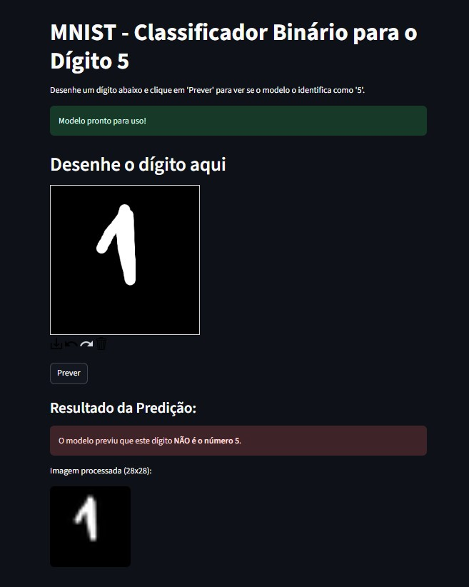
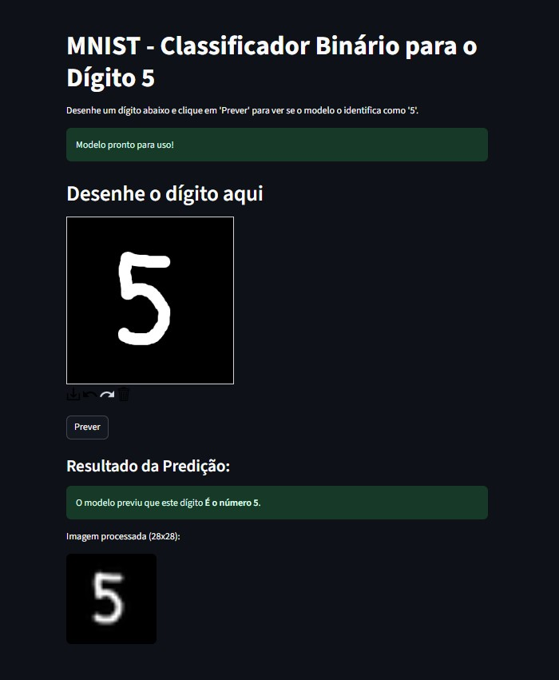

# Streamlit App: Classificador Binário MNIST

Este é um Data App desenvolvido com Streamlit que utiliza um modelo de Machine Learning (SGDClassifier) para realizar uma classificação binária. O objetivo do modelo é identificar se um dígito desenhado à mão é o número 5 ou não.

A aplicação utiliza a biblioteca streamlit-drawable-canvas para permitir que o usuário desenhe um dígito em tempo real e obtenha a predição do modelo.

## Como Executar o Projeto
Siga os passos abaixo para executar a aplicação em seu ambiente local.

### Pré-requisitos
Python 3.8 ou superior

pip (gerenciador de pacotes do Python)

## Passos
Clone o repositório:

git clone https://github.com/pedrodavi120/Tarefa1ML.git
cd Tarefa1ML

### Crie um ambiente virtual (recomendado):

python -m venv venv
source venv/bin/activate  # No Windows: venv\Scripts\activate

### Instale as dependências:
Crie um arquivo requirements.txt com o conteúdo abaixo e execute o comando pip:

## Print da Aplicação em Funcionamento

### Print do programa identificando que NÃO É o número 5.

    

### Print do programa identificando que É o número 5.

    

